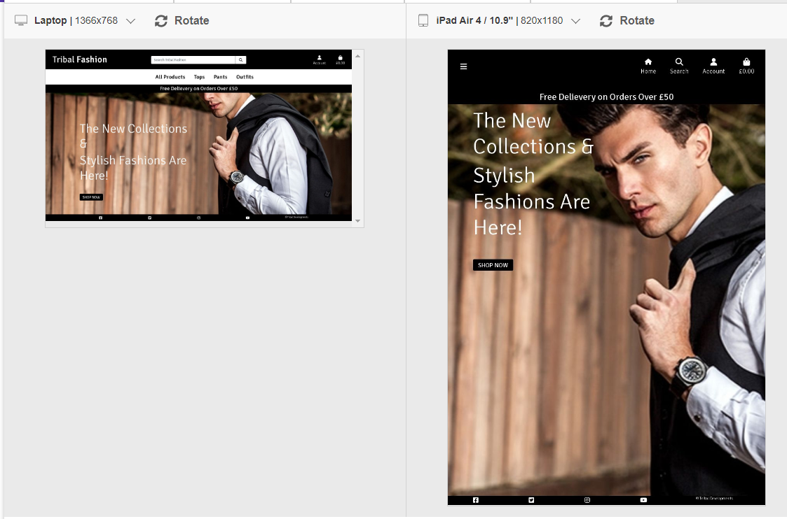
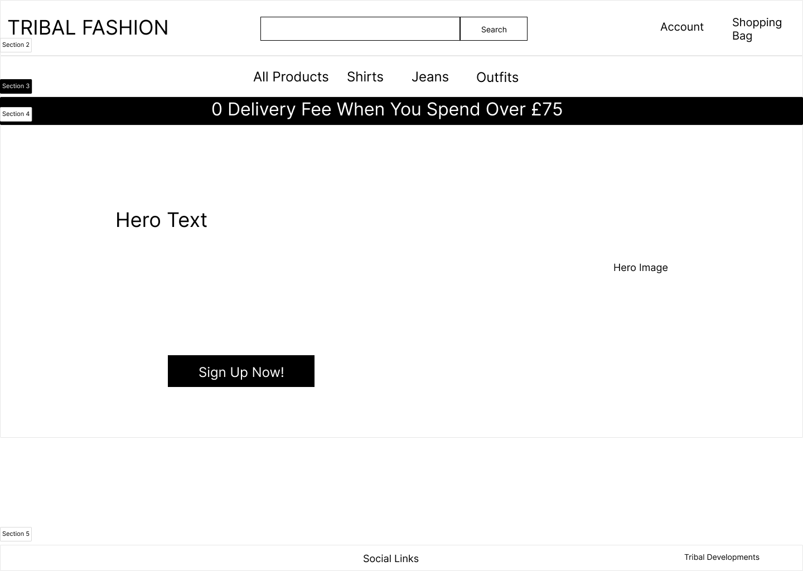
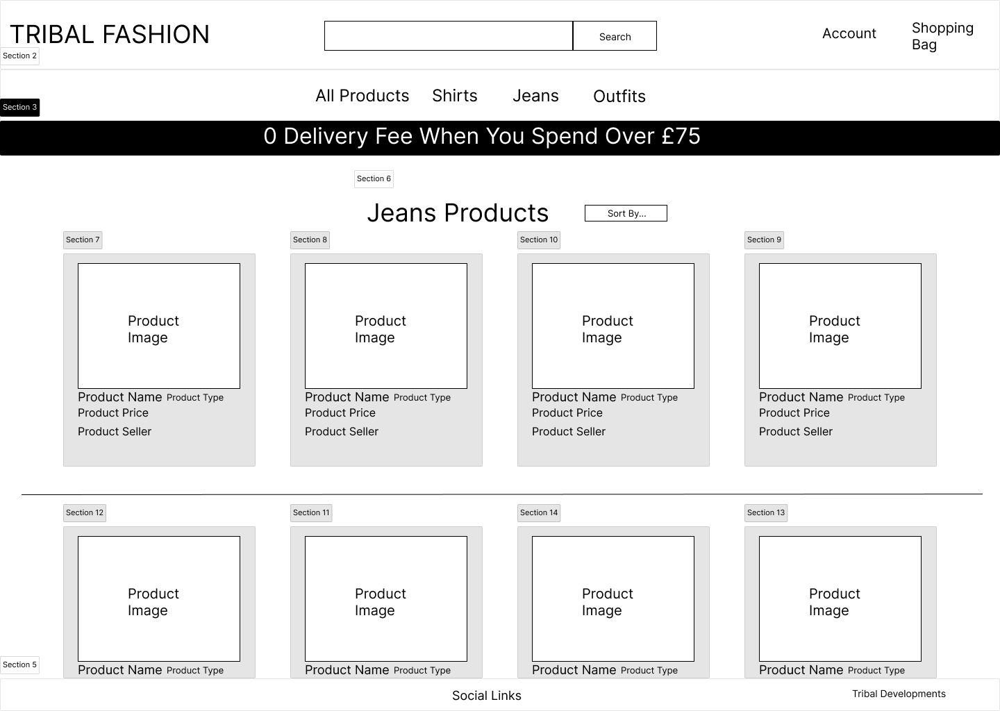
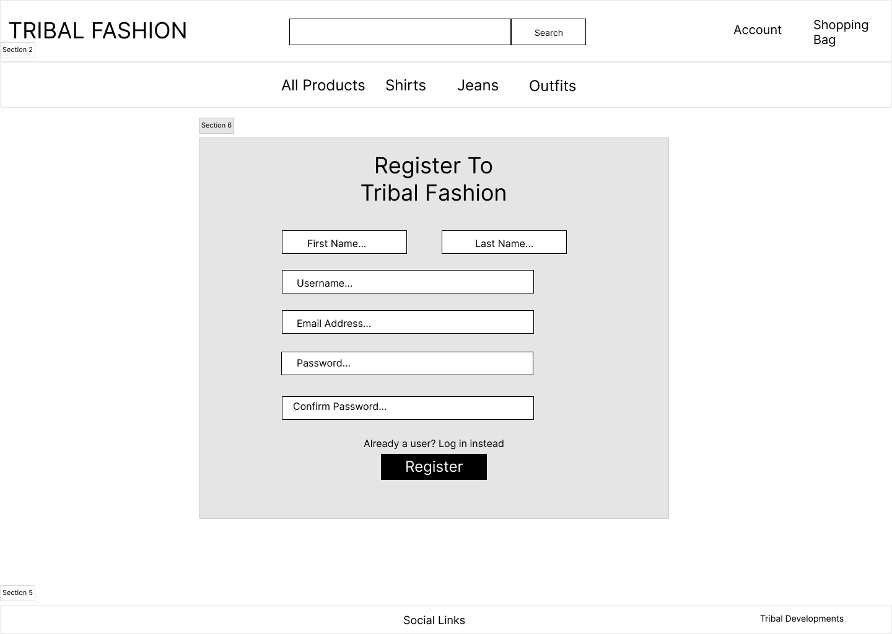
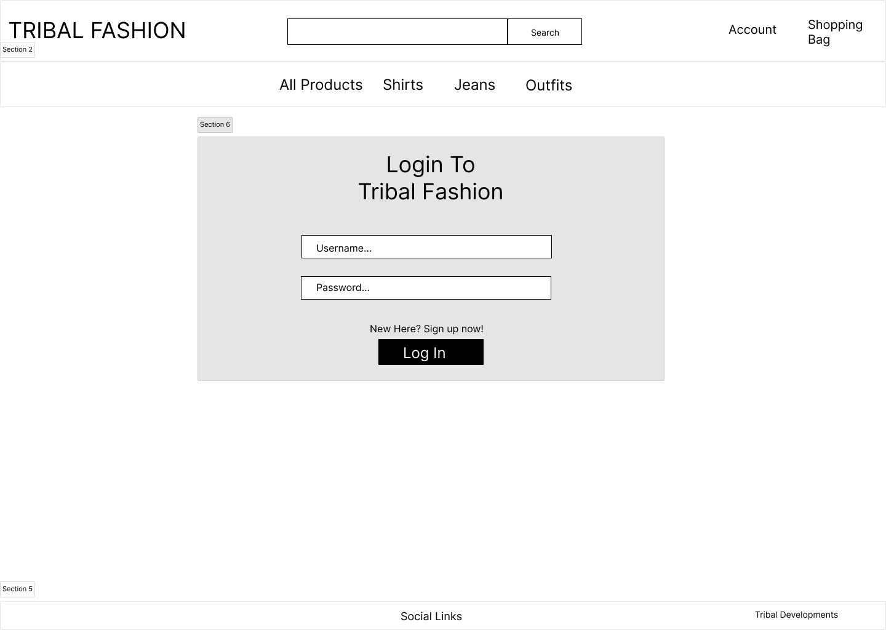
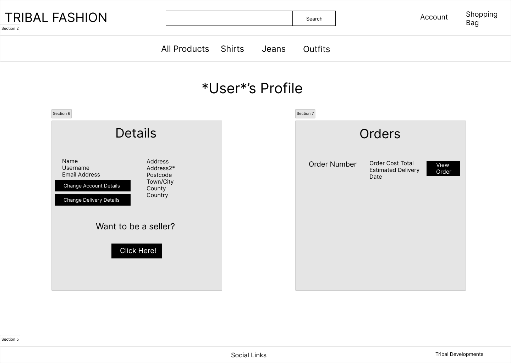
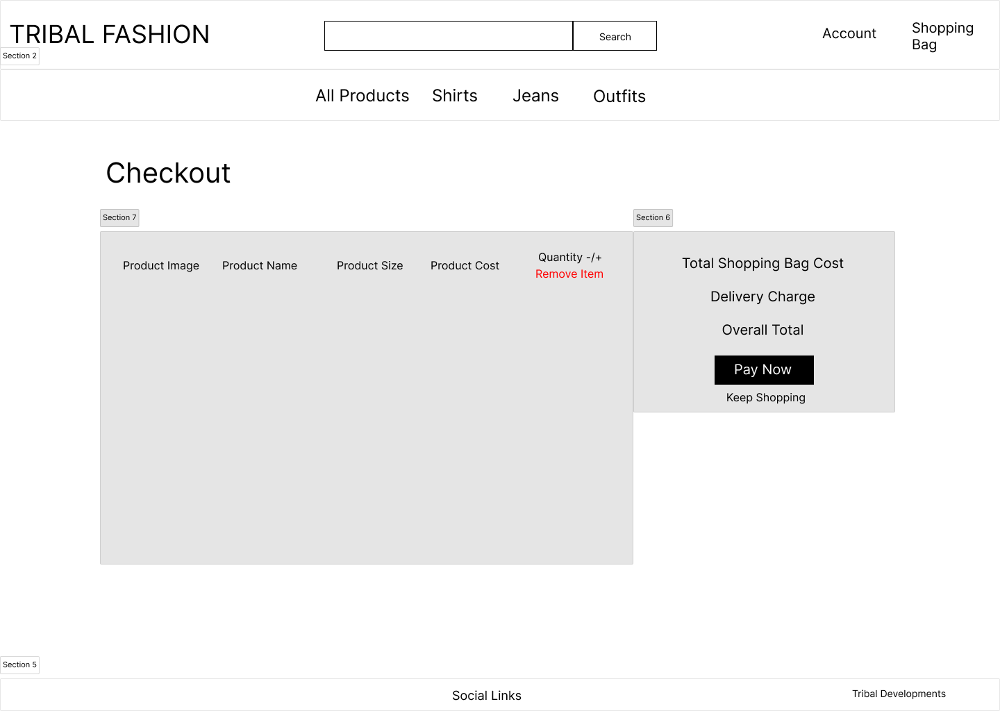
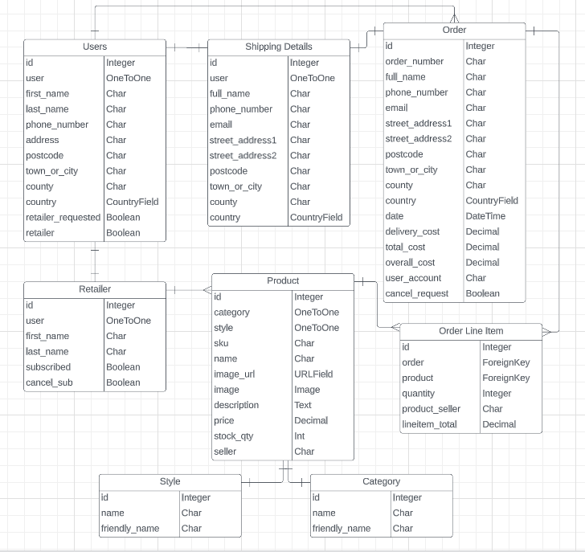
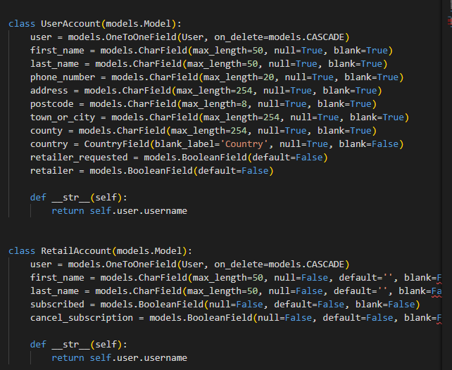

# Tribal Fashion

Click here to vist the [Tribal Fashion](https://tribal-fashion-abaron.herokuapp.com/) website

## Project Purpose
This project will combine together the basic structuring of HTML & CSS with backend properties such as CRUD functionalities to manage data to and from the database as well viewing certain records within the database. Alongside with new additional properties to ascend the project into a full-stack fully function fashion ecommerce website.

----
## User Stories
[Click here](https://docs.google.com/spreadsheets/d/1U8RlZcZcJxxOejVObKqq8daRQ9pqpkSGK3E2BsfQxGE/edit?usp=sharing) to redirect to view the user stories list for Tribal Fashion.

----
## Features
* All Users:
    * Register/Login
    * View products
    * Add products to a shopping bag and checkout
    * Order and pay for products within the shopping bag

* Customer Users:
    * Save delivery/shipping details for their account
    * Change/Add details for their account
    * Apply to become a retailer on the website

* Retail Users:
    * Add their own products to the website
    * View money made in their account wallet
    * Update or Delete products they've added
    * Subscribe to premium to eliminate the fee taken from their wallet

* Admin Users:
    * Add products to the website
    * Update/Change products (i.e Products description/reviews or moving a product to a special offer)
    * Manage user accounts (e.g giving a user retailer functionalities)
    * Remove products from the site

----
## Future Features
* New Users:
    * Retrieve a verification email to complete account registration
* Retail Users:
    * Withdraw money from their account wallet

----
## Wireframes
### Home Page

### Products Page

### Register Page

### Login Page

### Profile Page

### Checkout Page

## Database
With databases there are 2 different types of databases which are relational and non-relational, the main thing that seperates these types are that one incorporates relationship between the tables with the database schema and the other doesn't. For this production PostgreSQL will be the database used which is a relational database and to demonstrate how the relationships look find the ERD diagram below.

ERD (Entity Relationship Diagram)

The ERD shown above displays the several models that will be created/used within the production of the website, also shown within the ERD are the relationship types between each model such as One-to-One or One-to-Many that are being used. Looking on the two entities on the left, the User and Retailer entity creating these models within Django can be executed as seen below.

Taking the UserAccount model into consideration and implementing how a user can create a UserAccount record and with the form shown below, a newly registered user will need to complete this form in order to access their profile page for the first time.

## Technology Used
Figma - Used to build/create the visual outline for the different web pages that the website consists of.

GitPod - Cloud based IDE used to create and build the code for the website.

HTML - Programming language used to build the structure of the website/web pages by the use of elements and different components.

CSS - The styling for the website, used to make the web pages more visually appealing.

Bootstrap - An external libary used that aims to focus on the resposiveness of the website, as well as the basic structure and styling for the website.

Django - A fullstack framework used to structure the web application by compiling seperate apps containing templates, views, urls, models etc for different parts of the site.

Python - Programming language used to construct the functionality for the website that allows data to be intergrated from the database to the user and reversed based on a users interactions.

PostgresSQL - Relational database used to store data that has been added by a user in to different tables and relays data back through various queries.

JavaScript - Provides additional functionality but is mainly used to initialize Materialize components such as the modals, datepicker etc.

GitHub - A cloud based storage used as the version control for the production by committing and pushing at various stages throughout the development.

Stripe - A payment service used for checkout and subscription features.

ElephantSQL - Used to host the SQL server in the final deployment.

AWS - Used to store and retrieve static files such as CSS and Media files

Heroku - Used to deploy the final development.

----
# Testing
[Click here](docx/testing.md) to redirect to the Testing file

## Screens
Each web pages has been tested to make sure that they are fully responsive across all screen sizes beginning with mobile devices and increasing upwards to tablets, laptops and finally desktops as it's the largest screen size expected for a browser window.

----
## Deployment
Two versions on deployment:
* GitPod - used throughout the development by typing 'python3 manage.py runserver' in the terminal which gives a prompt to open in a new tab within the browser.
* Heroku - the final deployment of the website which makes it accesible to the public.

----
## Credits

### External Code
* Stackoverflow:
    * [Generating product SKU](https://stackoverflow.com/questions/2257441/random-string-generation-with-upper-case-letters-and-digits)

### External Pages
* Stripe Subscription Payment