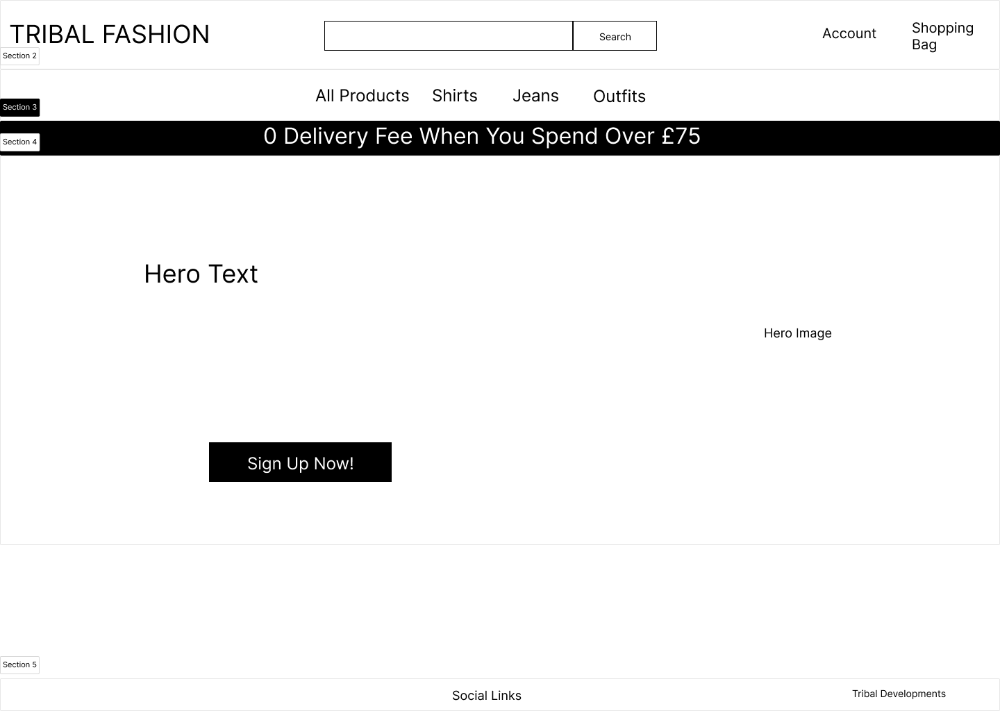
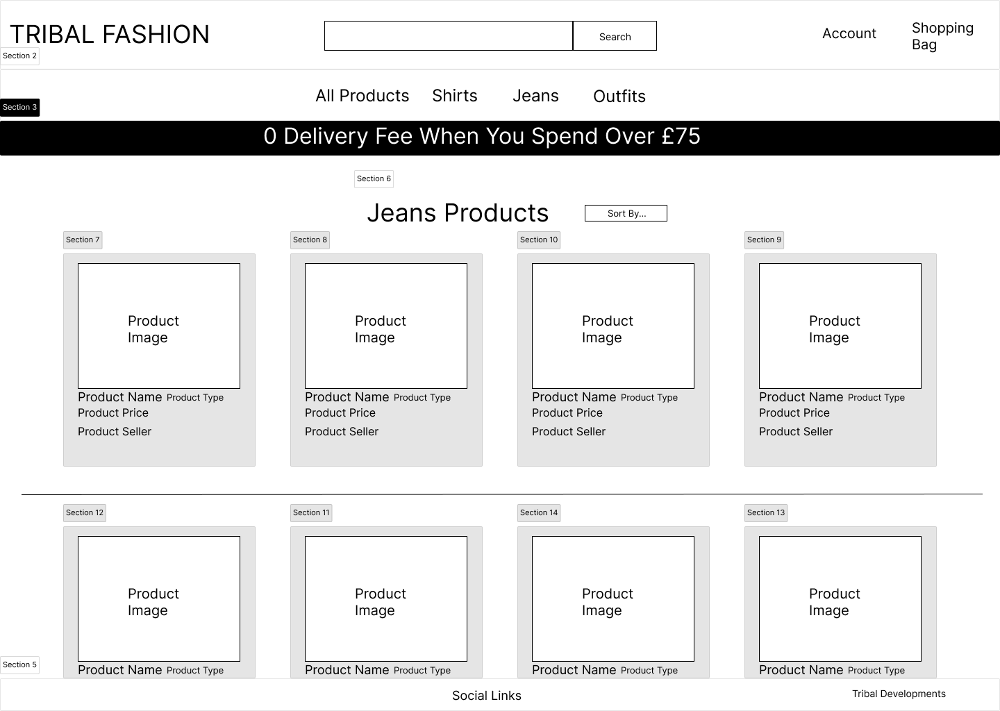
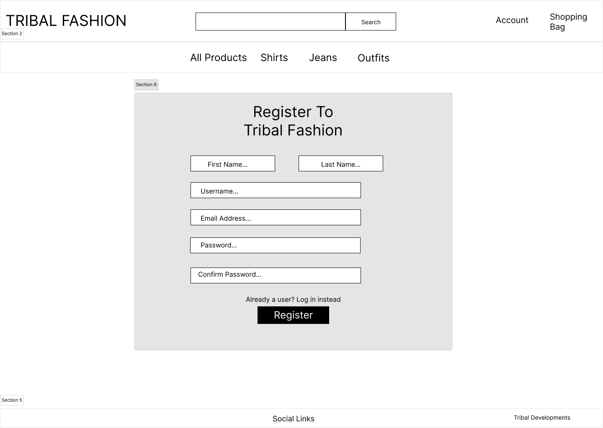

# Tribal Fashion
responive-image

Click here to vist the Tribal Holidays(link) website

## Project Purpose
This project will combine together the basic structuring of HTML & CSS with backend properties such as CRUD functionalities to manage data to and from the database as well viewing certain records within the database. Alongside with new additional properties to ascend the project into a full-stack fully function fashion ecommerce website.

----
## User Stories
[Click here](https://docs.google.com/spreadsheets/d/1U8RlZcZcJxxOejVObKqq8daRQ9pqpkSGK3E2BsfQxGE/edit?usp=sharing) to redirect to view the user stories list for Tribal Fashion.

----
## Features
* All Users:
    * Register/Login
    * View products
    * Add products to a shopping bag and checkout
    * Order and pay for products within the shopping bag

* Customer Users:
    * Save delivery/shipping details for their account
    * Change/Add details for their account
    * Apply to become a retailer on the website

* Retail Users:
    * Add their own products to the website
    * Checkout money made from their account wallet
    * Update or Delete products they've added

* Admin Users:
    * Add products to the website
    * Update/Change products (i.e Products description/reviews or moving a product to a special offer)
    * Manage user accounts (e.g giving a user retailer functionalities)
    * Remove products from the site

----
## Future Features

----
## Wireframes
### Home Page

### Products Page

### Register Page

### Login Page

### Profile Page

### Checkout Page
