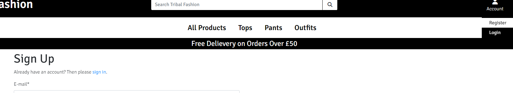
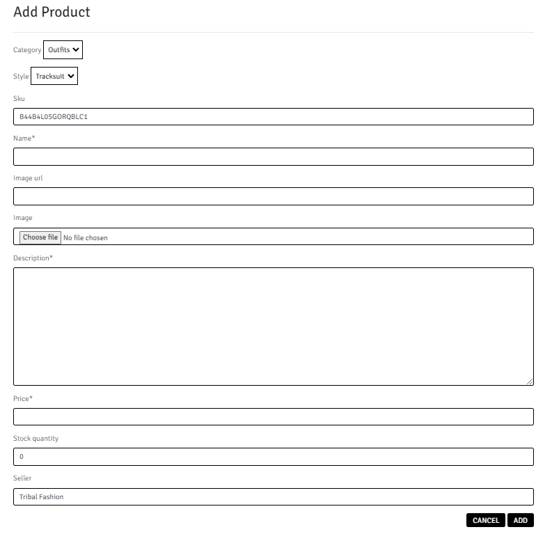
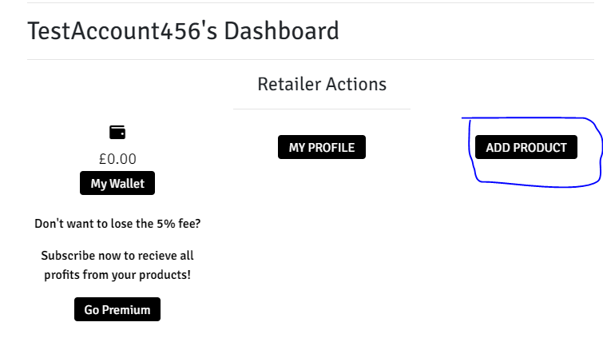

# Testing
## User Stories
US = User story (e.g US One = user story one)

[Click here](https://docs.google.com/spreadsheets/d/1U8RlZcZcJxxOejVObKqq8daRQ9pqpkSGK3E2BsfQxGE/edit?usp=sharing) to redirect to view the user stories list for Tribal Fashion.

### Navigating & Viewing
#### Viewing all products:
1. Locate nav options below the search bar.
2. Select 'All Products' nav option.
3. Click 'All Products' in the dropdown menu.

#### Viewing product details:
1. Navigate to the products page.
2. Find and select a product.
3. Click either the 'View' button or the product image.

#### Viewing certain categories:
1. Locate the center nav options.
2. Select either Tops, Pants or Outfits.
3. Click the option at the bottom of the dropdown menu.

#### Viewing your shopping bag total:
1. Look to the top right of your screen.
2. Look at the bag icon.
3. Shopping bag total is underneath the icon.

### User Accounts
#### Registering a new account:
1. Locate the account icon at the top right of the screen.
2. Select 'Register' from the dropdown menu.
3. Fill out the form and submit it.

#### Logging into your account:
1. Locate the account icon at the top right of the screen.
2. Select 'Login' from the dropdown menu.
3. Enter your Email/Username and password then click 'Login'.

#### Viewing your profile:
1. Locate the account icon at the top right of the screen.
2. Select 'My Profile' from the dropdown menu.
3. (*Newly registered user*) Fill out the set up form.

### Sort & Searching
#### Searching products:
1. Locate the search bar at the top of the screen.
2. Enter your search query and either press enter or click the search icon.

#### Sorting products
1. Navigate to the products pages.
2. Find the dropdown menu on the right hand of the page.
3. Select either of the options to sort the products by name/price etc.

### Checkout & Purchasing
#### Checkout & purchase the items in your shopping bag:
1. Locate the bag icon on the top right of your screen and click.
2. View the items in your shopping bag and make adjustments if you want to.
3. Click the 'Secure Checkout' button.
4. Fill out the shipping form & enter card payment details.
5. Click the 'Complete Order' button.

#### View the orders I've placed:
1. Locate the account icon at the top right of the screen.
2. Select 'My Profile' from the dropdown menu.
3. Find the orders you've placed on the right side of the screen.
(Mobile Users) Orders will be underneath account details.

### Products
#### Adding products as an admin user:
1. Login with admin credentials. 
2. Locate the account icon at the top right of the screen.
3. Click 'Admin Management'.
4. Click 'Add Product' in the admin controls section.
5. Fill out the product form and submit it.

#### Updating products as an admin user:
1. Login with admin credentials. 
2. Locate the account icon at the top right of the screen.
3. Click 'Admin Management'.
4. Click the image of the product you want to update with the Products section on the right of the page.
5. Fill out the product form and submit it.

#### Adding products as an retailer user:
1. Login into your account. 
2. Locate the account icon at the top right of the screen.
3. Click 'My Profile'.
4. Click 'My Dashboard'.
5. Click 'Add Product'.
6. Fill out the product form and submit it.

### Selling
#### Viewing my products:
1. Login into your account. 
2. Locate the account icon at the top right of the screen.
3. Click 'My Profile'.
4. Click 'My Dashboard'.
5. Find your products on the right of the page.

#### Viewing my retailers wallet:
1. Login into your account. 
2. Locate the account icon at the top right of the screen.
3. Click 'My Profile'.
4. Click 'My Dashboard'.
5. Find your wallet balence on the left side of the page.

#### Subscribing to retailer premium:
1. Login into your account. 
2. Locate the account icon at the top right of the screen.
3. Click 'My Profile'.
4. Click 'My Dashboard'.
5. Click 'Subscribe' on the left hand side of the page.
6. Fill out the payment form and submit it.

----
## User Interaction
### Adding a Product To Your Shopping Bag

After clicking to view a product in order to add the item to your shopping bag just set the quantity using either the -/+ icons or manually enter the amount the click 'Add To Bag'

### Applying to Become a Retailer

After creating the record in the custom UserAccount model with the profile setup page, when a user views their profile page they will be prompted with the option to apply to become a retailer. All they need to do is click the 'Apply To Retail' button and their request will be sent to the admin users for review.

### Cancelling an Order

If a user wants to cancel their order and they have an account linked to the order, if they sign in to the account and then view the order through their profile page. They can click the 'Cancel' button on the bottom left of the page and the request to cancel the order will be sent to the admin users.

### Changing Account Password

If a user wants to change their password, they can navigate to their profile page and at the bottom of the page underneath the form with their account details they can click the 'Change Password' button. Enter in their old password and then enter their new password twice submit it and their password is now changed.

----
## Defensiveness
### Attempting to view profile without being logged in

### Attempting to view the admin dashboard without being an admin user

### Attempting to add products without being an Admin or Retailer user

----
## Code Validation
### HTML
Within the first two validiation screenshots the errors/warnings shown aren't critical issues with the website but would cause issues if attempted to change so have been hidden for the rest.

Admin Management, Profile, Retailer Dashboard & Add product page/pages haven't been validated due to the pages being protected with 'Login Required'
#### Home

#### Products

#### Shopping Bag

#### Checkout

----
### CSS

Extended CSS for Checkout Page

----
## Bugs
### Profile Page Bug

As seen above during development whenever attempting to view the profile the site kept throwing a 404 error, the reasoning for this was because the profile page retrieves a users info from the custom UserAccount model and at the time there was no way for a user to create their record within the custom model.

So the addition was made that if a newly registered user was to go to their profile page the nav link will direct to the form shown below for the user to create a record for the custom model but if the user has already created a record then it'll just go straight to their profile page.

### Checkout Bug

The bug above occured when a logged in user is attempting to checkout and purchasing products without the save info box checked, the reason for this bug occurance was because with the checkout view code it tries to set a variable that will be passed to the order success view to check if the user wanted to save their shipping/delievery information but if the option isn't checked then there is no save info value within the 'request.POST' dictionary.

The change to the code that resolved the issue is shown below and all that is happening is that it is checking to see if there is a 'save-info' key within the 'request.POST' dictionary and if there is then it's setting the variable to the value else it'll set the variable to a None value.

